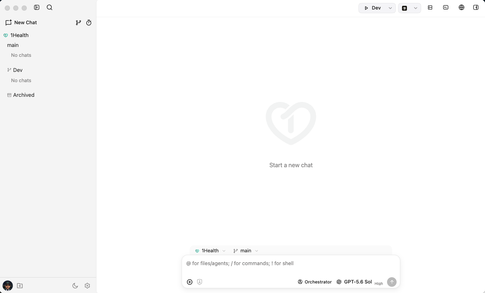

# DevRyan

## **OpenCode, everywhere.** Desktop. Browser. Phone.

### A rich interface for [OpenCode](https://opencode.ai). Review diffs, manage agents, run dev servers, and keep the big picture while your AI codes.



## Development

Run the full local stack with:

```bash
npm run dev
```

The dev orchestrator keeps the API, web build watcher, and UI typecheck watcher running. If a child process exits unexpectedly, it is restarted automatically. Press **Ctrl+C** in the terminal to stop everything.

Use **Services → Stop DevRyan** in the app when you want to end the dev stack from the UI (with confirmation).

## Why use DevRyan?

- **Cross-device continuity**: Start in TUI, continue on tablet/phone, return to terminal - same session
- **Remote access**: Use OpenCode from anywhere via browser
- **Familiarity**: A visual alternative for developers who prefer GUI workflows
