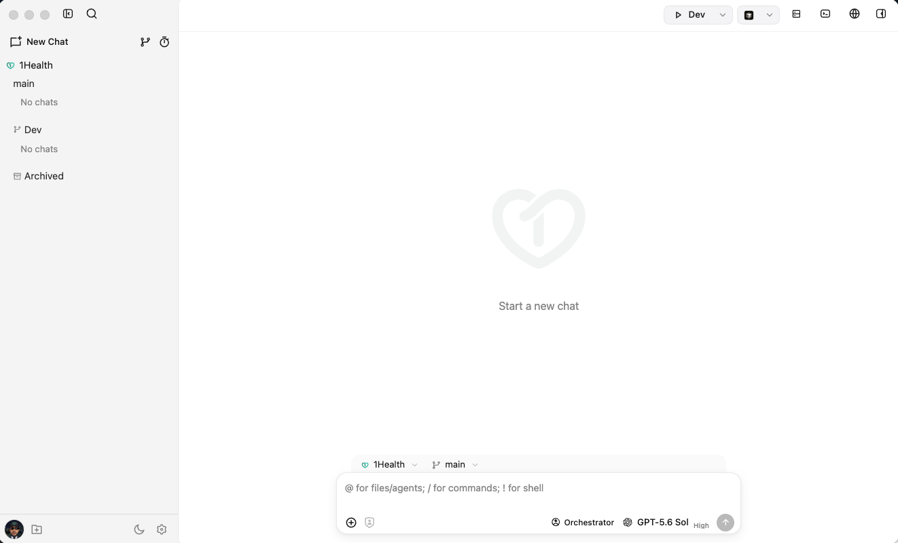

# DevRyan

## **OpenCode, everywhere.** Desktop. Browser. Phone.

### A rich interface for [OpenCode](https://opencode.ai). Review diffs, manage agents, run dev servers, and keep the big picture while your AI codes.



## Installation

Download the macOS Apple silicon DMG (`DevRyan-<version>-arm64.dmg`) from [DevRyan releases](https://github.com/1H-Team/DevRyan/releases). Use Update in the app to stop the background runtime and open the verified download, then quit DevRyan and replace the app manually. If downloading directly, turn off the background runtime in Settings → Bots before quitting. macOS builds are ad-hoc signed. Windows x64/ARM64 installers, when published, are unsigned prereleases; see [docs/RELEASE_PIPELINE.md](docs/RELEASE_PIPELINE.md) for release assets and qualification gates.

In a qualified SIWC build, open **Settings → Providers → OpenAI → Continue with ChatGPT**. Reconnect legacy ChatGPT OAuth accounts. Sign-in and permission to use a ChatGPT plan are separate: if plan usage is disabled, explicitly authorize it or choose API-key authentication. Image generation requires an explicitly selected OpenAI API key and uses API billing; SIWC does not support image generation. No billing fallback is automatic.

## Development

Use Node.js 22.13 or newer and the Bun version pinned in `package.json`. Install dependencies with `bun install --frozen-lockfile`, then run the full local stack with:

```bash
bun run dev
```

The dev orchestrator keeps the API, web build watcher, and UI typecheck watcher running. If a child process exits unexpectedly, it is restarted automatically. Press **Ctrl+C** in the terminal to stop everything.

Use **Services → Stop DevRyan** in the app when you want to end the dev stack from the UI (with confirmation).
